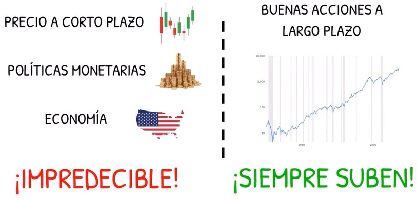

# Análisis Fundamental

## Previos

    
    
"La historia ha demostrado que las acciones suben a largo plazo"

    
    
"La historia ha demostrado que las acciones suben a largo plazo"

## Cuenta de Resultados

## Balance General

## Flujos de Caja